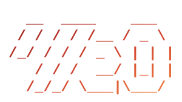

# Abdusamadbek Akhmadjonov

### Software engineer — full-stack, across the whole stack.

## whoami

Software engineer. I work across the whole stack: backend, frontend, mobile, and the infrastructure under it. I've built things like **[Uption](https://uption.ai)** (a compliance SaaS for US trucking), payment systems, and internal platforms. Mostly TypeScript and Python, and I pick up whatever a project needs.

## stack

## reach

&nbsp;&nbsp;

&nbsp;&nbsp;

Mostly side projects and experiments here. The work I'm paid for is private, and the full picture is on my site.
